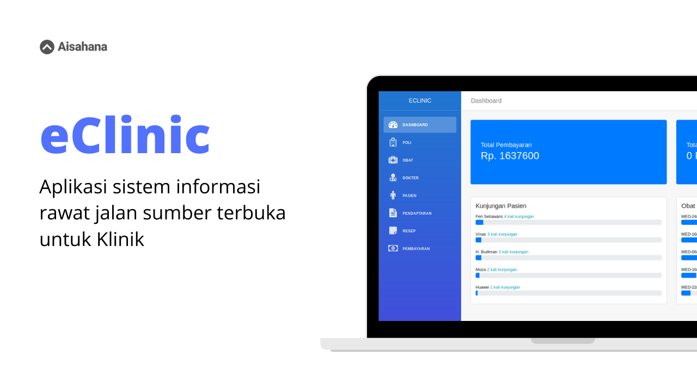

## eClinic Admin

Ini adalah API untuk eClinic. eClinic adalah aplikasi sistem informasi
rawat jalan sumber terbuka untuk klinik.

## API
Karena aplikasi ini membutuhkan API, API eClinic bisa Anda dapatkan [disini](https://github.com/aisahana/eclinic_api).

### Quick Setup
Clone repo ini lalu jalankan perintah:

```
# install dependencies
npm install

# serve with hot reload at localhost:8080
npm run dev

# build for production with minification
npm run build

# build for production and view the bundle analyzer report
npm run build --report
```

Setelah selesai, jalankan development server:

API telah siap digunakan dengan mengakses:

```
http://localhost:8080
```

## Demo
Anda bisa melihat demonya
[disini](https://www.youtube.com/playlist?list=PLq10xSDEwzczYJ3luDICP2JbM9I7A0rmK).


